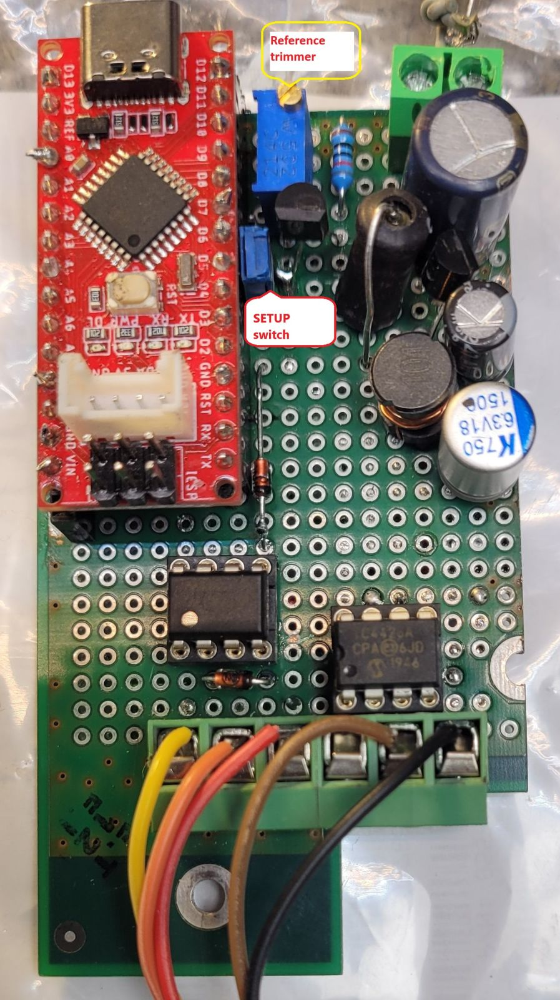

# arduino_hssp

This is a fork of the original arduino_hssp https://github.com/acidwise/arduino_hssp because I want to rebuild it for Arduino nano and give it to work.

As for me original branch have problem with TARGET VDD pin.

Also board work with tty transfer speed 57600 maximum, but maybe because I have usb cable 3 meters (?)

I will store sketch into src folder

Also I'll add schematic for my programmer, because my boards needs more then 150 ma power current from 5V - pin of Arduino must give no more 40ma

## Usage

Clone the code from src into a folder called 'arduino_hssp', open the project in the Arduino IDE and compile and program it. Connect your PSoC 1 device as follows :
```
Pin   - PCB - Arduino
------------------------
GND   -  1  -  TARGET SUPPLY, pin 12 arduino with power switch 
Power -  2  -  GND
XRES  -  3  -  10
SCLK  -  4  -  8
SDATA -  5  -  9
```
Can be changed in issp_defs.h and revise schematic connection (see schematic folder)

## My board



Then close SETUP switch, connected to pin 7 Arduino Then connect programmer to PC and communicate with it over serial port with baudrate 57600. 

I make setup procedure over windows and arduino terminal, but putty also work.

You can observe simple menu
```
MENU:  pls choice what you want
baudrate <*nnn> -> setup serial interface baudrate
target <*n=0,1,2> - check power pin speeds, where
*******0 -use hardware setup
*******1 -use measured setup, but by software
*******2 - use default settings 150uSec
*******3- show only
supply - test target voltage
exit - exit setup
Showcurrent - Show current settings
```

1. Measure target supply by command * *supply* *  . In this step Arduino measured voltage on PRE switch place, test board not receive any signal or Supply

2. Setup serial interface baudrate for work. Available command is  __baudrate 115200__ , __baudrate 57600__, __baudrate 38400__, __baudrate 19200__

3. Setup Target supply delay time (see explain into hardware folder).  Command is
   
**target 0** - In this case use delay by hardware comparators +150 usec, but timeON and timeOFF will displayed on terminal

**target 1** -  In this case, the program determines the larger of timeON and timeOFF, adds 150 microseconds to it, and writes it to flash. This value will be used as a delay time during operation.

**target 2** - In this case software will use default delay time 150 microseconds for switching supply.

**target 3** - in this case we can see stored into EEPROM

THATS all, you can disconnect external power supply, programmer from PC , **remove** SETUP switch and connect to PC with psocdude by miracoli https://github.com/miracoli/psocdude .


In my case  as Arduino nano it read device from command :

```
psocdude -C /usr/local/etc/psocdude.conf -p -D CY8C24894 -c arduino -P /dev/ttyUSB0 -b 57600 -U flash:r:flash.bin:r
```

## TODO

Check support for parametrization by host.

The parametrization packet is currently 5 bytes long and contains the following values:

- programming_mode selection (power cycle vs external reset)

- target_voltage selection

- checksum_setup vector selection

- program_block vector selection

- multi_bank support selection

Need check how it work - I plan add second Serial port to arduino (software serial ) and debug some data.

Add support for use programmer with multiple target chips without recompile Arduino sketch. 
