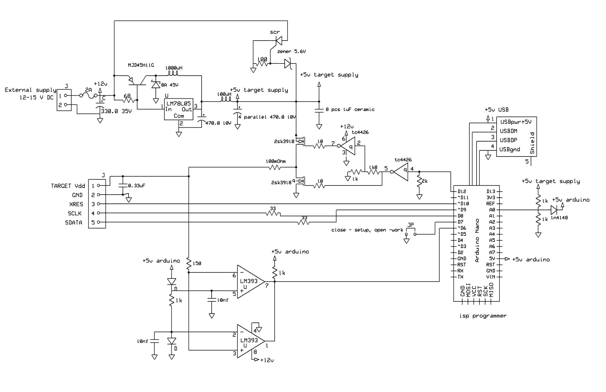

# arduino_hssp programmer schematic

This is  my building of programmer hardware 

Such a complex circuit is needed because there are many more chips on my board that are powered by the same 5 Volt voltage. 

There are  many capacitors on the board also , so turning these 5 Volts on and off with a regular Arduino is quite problematic, an amplifier is needed

## My board

## My programmer board schematic

I see more then 30 Amper peek curents during charge and discharge capacitor 100 uF on output.

Time for charge and discharge some like 45 usec, so I add comparator for make delay as need.

[See test results](./schematic/test_result/README.md)

I begin rewrite Arduino programm 