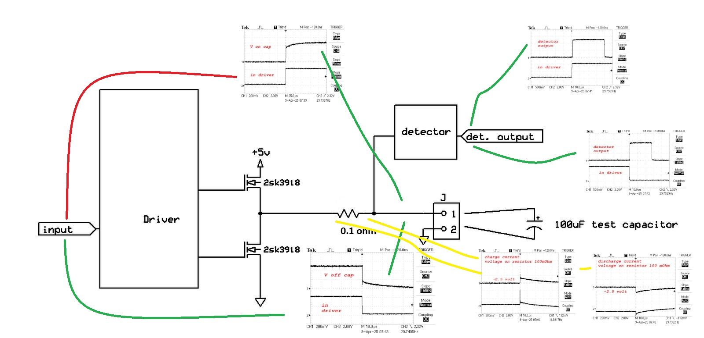

This is result of test  my  programmer hardware 

I see that the supply voltage stabilizes after some time, with a 100 μF capacitor

this time is approximately 30-40 μseconds, provided that 

the detection thresholds are approximately 0.6 and 4.3 volts.

At the same time, the pulse current is quite large, the oscilloscope sees 25-30 ampers.

With a larger capacity, which is usually on the board under study, the voltage establishment time 

will be longer, which means it is necessary to introduce a command delay adjustment or use the detector output readiness.

I will use both methods - the delay can be adjusted and stored in its eeprom plus I make feedback for TARGET VOLTAGE

