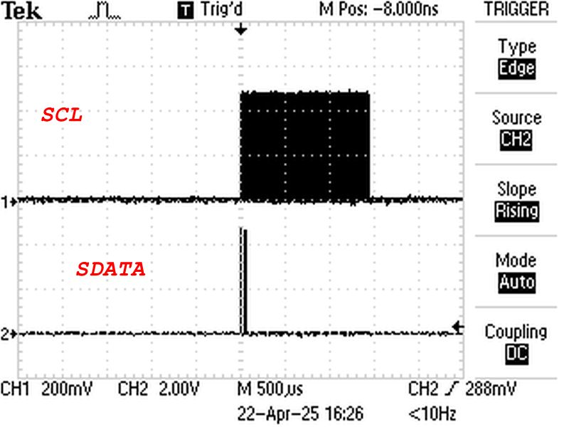

## Run with my hardware
I connect Target board to Arduino and over terminal tested all terminal menu.

Time delay for switch Supply power on|off measured as 860 usec, I choice software delay with measured values **target 1** serial command

Then I measure Supply voltage **supply** serial command - show 4.94 Volt (_ _real 4.97 volt , FLUKE 12_ _)

Then I choice communication speed **baudrate 115200** and verify my settings with command **Showcurrent**

All settings was as expected.

Then I disconnect programmer from Windows pc and connect to Ubuntu PC

But it not work with com speed 115200, I don't know why - USB cable was 0.5 meters and new one. Problem not a cable.

I replace speed setting over terminal to 57600 and building begin to run over command
```
sudo /usr/local/bin/psocdude -D -C /usr/local/etc/psocdude.conf -c arduino -P /dev/ttyUSB0 -b 57600 -p CY8C24894 -U flash:r:flash1.bin:r
```

But file flash1.bin was strangle - I think flash is protected - so I must use trou work tool. 

I adopt psoc.py for my hardware, file placed in <ins>linux/Cypress_psoc_tool</ins> folder

When I run it I see as software connect to Target board 
``` 
./psoc.py 
syncing:  KO KO KO OK 
```

But then terminal was type me over 1 hour
```
Resetting PSoC: KO
```
I begin to check signals XRESET - present pulse low to high pulses, as 000000010000000

Pulses on CLK and DATA pins show on picture


I understand PSOC chip not response to programmer - I begin check all software and find something strangle into verbose  verbose output from psocdude
```
sudo /usr/local/bin/psocdude -D -v -C /usr/local/etc/psocdude.conf -c arduino -P /dev/ttyUSB0 -b 57600 -p CY8C24894 -U flash:r:flash1.bin:r
```

I put output to log.txt

Problem places

1. **Importand**

```
Checksum setup                : CHECKSUM_SETUP_24_24A
```

Into psocdude.conf placed TRUE 
```
checksum_setup = CHECKSUM_SETUP_22_24_28_29_TST120_TMG120_TMA120;
```

***I undestand PSOC chip just dont know what it must do***

```
2.
flash mode as 65, but defined as 0x41. Maybe psocdude simple convert hex to decimal?


