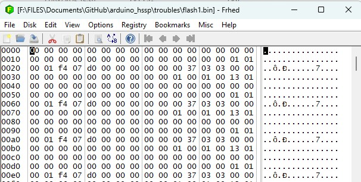

## Run with my hardware
I connect Target board to Arduino and over terminal tested all terminal menu.

Time delay for switch Supply power on|off measured as 1910 usec, I choice software delay with measured values **target 1** serial command

Then I measure Supply voltage **supply** serial command - show 4.94 Volt (_ _real 4.97 volt , FLUKE 12_ _)

Then I choice communication speed **baudrate 115200** and verify my settings with command **Showcurrent**

All settings was as expected.

Then I disconnect programmer from Windows pc and connect to Ubuntu PC

But it not work with com speed 115200, I don't know why - USB cable was 0.5 meters and new one. Problem not a cable.

I replace speed setting over terminal to 57600 and building begin to run over command
```
sudo /usr/local/bin/psocdude -D -C /usr/local/etc/psocdude.conf -c arduino -P /dev/ttyUSB0 -b 57600 -p CY8C24894 -U flash:r:flash1.bin:r
```

But file flash1.bin was strangle it attachet as flash1.bin



 - I think flash is protected - so I must use trou work tool. 


I adopt psoc.py for my hardware, file placed in <ins>linux/Cypress_psoc_tool</ins> folder

When I run psoc.py I see as software connect to Target board 
``` 
./psoc.py 
syncing:  KO KO KO OK 
```

But then terminal was type me over 1 hour
```
Resetting PSoC: KO
```
I begin to check signals XRESET - present pulse low to high pulses, as 000000010000000

Pulses on CLK and DATA pins show on picture


I understand PSOC chip not response to programmer - I begin check all software and find something strangle into verbose  verbose output from psocdude
```
sudo /usr/local/bin/psocdude -D -v -C /usr/local/etc/psocdude.conf -c arduino -P /dev/ttyUSB0 -b 57600 -p CY8C24894 -U flash:r:flash1.bin:r
```

I put output to log.txt
```diff
~/psocdude$ sudo /usr/local/bin/psocdude -D -v -C /usr/local/etc/psocdude.conf -c arduino -P /dev/ttyUSB0 -b 57600 -p CY8C24894 -U flash:r:flash1.bin:r
[sudo] password for proger: 

psocdude: Version 0.9.0, compiled on Mar 23 2025 at 10:21:14
          Copyright (c) 2015 Dirk Petrautzki
          Based on AVRDude 6.0.1

          System wide configuration file is "/usr/local/etc/psocdude.conf"
          User configuration file is "/home/proger/.avrduderc"
          User configuration file does not exist or is not a regular file, skipping

          Using Port                    : /dev/ttyUSB0
          Using Programmer              : arduino
          Overriding Baud Rate          : 57600
          PSoc device                   : CY8C24894
          Multi bank                    : yes
          Taget voltage                 : 5V
          Programming mode              : RESET_MODE
-         Checksum setup                : CHECKSUM_SETUP_24_24A
          Program block                 : PROGRAM_BLOCK_21_22_23_24_28_29_TST_TMG_TMA
          Memory Detail                 :

                                   Block Poll               Page                       Polled
            Memory Type Mode Delay Size  Indx Paged  Size   Size #Pages MinW  MaxW   ReadBack
            ----------- ---- ----- ----- ---- ------ ------ ---- ------ ----- ----- ---------
            signature      0     0     0    0 no          2    0      0     0     0 0x00 0x00
            flash         65     6    64    0 yes     16384   64    256     0     0 0x00 0x00

          Programmer Type : Arduino
          Description     : Arduino
          Hardware Version: 2
          Firmware Version: 1.18
          Topcard         : Unknown
          Vtarget         : 5.0 V

psocdude: AVR device initialized and ready to accept instructions

Reading | ################################################## | 100% 0.01s

psocdude: Device signature = 0x001f
psocdude: reading flash memory:

Reading | ################################################## | 100% 9.54s

psocdude: writing output file "flash1.bin"

psocdude done.  Thank you.
```
Problem places

1. **Importand**

```
Checksum setup                : CHECKSUM_SETUP_24_24A
```

Into psocdude.conf placed TRUE 
```
checksum_setup = CHECKSUM_SETUP_22_24_28_29_TST120_TMG120_TMA120;
```

***I undestand PSOC chip just dont know what it must do***

But psoc.py not use psocdude, so I have trouble with PSOC chips (tested 3 boards

2. flash mode show as 65, but defined as 0x41. Maybe psocdude simple convert hex to decimal?


